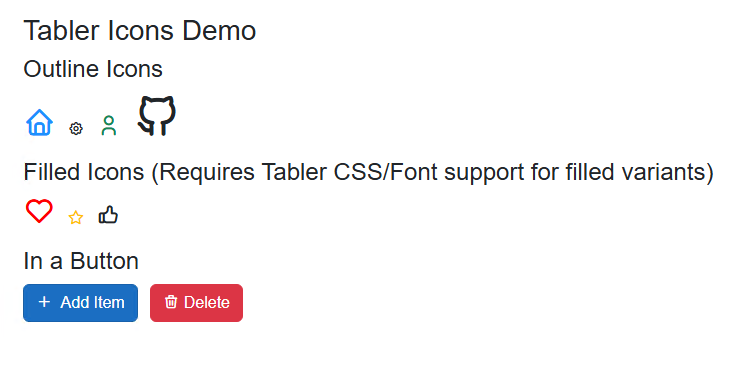

# Blazor Tabler Icons

A Blazor component library providing easy access to the beautiful [Tabler Icons](https://tabler-icons.io/) collection, with strongly-typed IntelliSense for icon selection.

[](https://www.nuget.org/packages/BlazorTablerIcons/)
[](https://www.nuget.org/packages/BlazorTablerIcons/)

This library uses the Tabler Icons webfont. You must include the Tabler Icons CSS in your Blazor application for the icons to render correctly.

## Features

*   **Strongly-Typed Icons:** Select icons using enums for both **Outline** and **Filled** styles, providing compile-time checking and excellent IntelliSense.
*   **Easy to Use:** Simple `<TablerIcon />` component with intuitive parameters.
*   **Customizable:** Control icon size, color, stroke width (for outline styles where supported by Tabler CSS), and add custom CSS classes.
*   **Automatic Name Generation:** Includes a PowerShell script to regenerate icon enums directly from a local clone of the official Tabler Icons repository, ensuring you can always stay up-to-date.

## Prerequisites

*   .NET 9.0 or later.
*   A Blazor project.

## Installation

1.  **Install via NuGet Package Manager:**
    ```powershell
    Install-Package BlazorTablerIcons
    ```
    or via .NET CLI:
    ```bash
    dotnet add package BlazorTablerIcons
    ```

2.  **Include Tabler Icons CSS:**
    In your main HTML file (`_Host.cshtml` for Blazor Server, `wwwroot/index.html` for Blazor WebAssembly, or `App.razor`/`_Layout.cshtml` in .NET 7+ layouts), add the Tabler Icons webfont CSS link within the `<head>` section. You can use the CDN:

    ```html
    <link rel="stylesheet" href="https://cdn.jsdelivr.net/npm/@tabler/icons-webfont@latest/tabler-icons.min.css">
    ```
    Alternatively, host the Tabler Icons webfont files yourself and link to your local copy.

3.  **Register Usings:**
    In your main `_Imports.razor` file, add:
    ```razor
    @using BlazorTablerIcons
    ```

## Usage

Use the `<TablerIcon />` component in your Razor files:

```razor
@page "/icons-demo"

<h3>Tabler Icons Demo</h3>

<h4>Outline Icons</h4>
<p>
    <TablerIcon OutlineIcon="TablerIconOutlineName.Home" Size="2rem" Color="dodgerblue" />
    <TablerIcon OutlineIcon="TablerIconOutlineName.Settings" Class="ms-2" />
    <TablerIcon OutlineIcon="TablerIconOutlineName.User" Size="24px" Color="var(--bs-success)" Class="ms-2" />
    <TablerIcon OutlineIcon="TablerIconOutlineName.BrandGithub" Size="3em" Class="ms-2" />
</p>

<h4>Filled Icons (Requires Tabler CSS/Font support for filled variants)</h4>
<p>
    <TablerIcon FilledIcon="TablerIconFilledName.Heart" Size="2rem" Color="red" />
    <TablerIcon FilledIcon="TablerIconFilledName.Star" Class="ms-2 text-warning" />
    <TablerIcon FilledIcon="TablerIconFilledName.ThumbUp" Size="24px" Class="ms-2" />
</p>

<h4>In a Button</h4>
<button class="btn btn-primary">
    <TablerIcon OutlineIcon="TablerIconOutlineName.Plus" Class="me-1" /> Add Item
</button>

<button class="btn btn-danger ms-2">
    <TablerIcon OutlineIcon="TablerIconOutlineName.Trash" /> Delete
</button>
```



### Component Parameters

| Parameter     | Type                    | Default                       | Description                                                                                                                                                           |
|---------------|-------------------------|-------------------------------|-----------------------------------------------------------------------------------------------------------------------------------------------------------------------|
| `OutlineIcon` | `TablerIconOutlineName` | `TablerIconOutlineName.None`  | Specifies the Outline style icon to display. Takes precedence if both `OutlineIcon` and `FilledIcon` are set. Provides IntelliSense for available outline icons.     |
| `FilledIcon`  | `TablerIconFilledName`  | `TablerIconFilledName.None`   | Specifies the Filled style icon to display. Used if `OutlineIcon` is `None`. Provides IntelliSense. *Note: Display of filled icons depends on Tabler webfont/CSS support.* |
| `Size`        | `string?`               | `null`                        | Custom size for the icon (e.g., "24px", "2rem", "1.5em").                                                                                                             |
| `Color`       | `string?`               | `null`                        | Custom color for the icon (e.g., "red", "#FF5733", "var(--my-color)").                                                                                                |
| `StrokeWidth` | `string?`               | `null`                        | For outline icons, suggests a stroke width (e.g., "1.5"). Effect depends on Tabler CSS support (e.g., via `--ti-stroke-width` custom property).                  |
| `Class`       | `string?`               | `null`                        | Additional CSS classes to apply to the `<i>` icon element.                                                                                                             |
| `AdditionalAttributes` | `Dictionary<string, object>?` | `null`        | Captures unmatched HTML attributes to apply to the icon element (e.g., `id`, `aria-label`).                                                                            |

**Note on Filled Icons:** The rendering of "filled" icons via the webfont depends on how the Tabler Icons webfont CSS is structured. The primary Tabler webfont is predominantly outline-based. True filled versions are most distinct with SVG assets. This component provides the `FilledIcon` enum for completeness if your Tabler CSS setup supports filled variants through the same class naming convention.

## Updating Icon Definitions (For Contributors / Maintainers)

The `TablerIconOutlineName` and `TablerIconFilledName` enums are generated from a local clone of the official [Tabler Icons GitHub repository](https://github.com/tabler/tabler-icons).

To update the icon definitions:

1.  **Ensure you have PowerShell.**
2.  **Clone or update your local Tabler Icons repository:**
    ```bash
    git clone https://github.com/tabler/tabler-icons.git path/to/your/tabler-icons
    # or if already cloned
    cd path/to/your/tabler-icons
    git pull
    ```
3.  **Run the generation script:**
    Navigate to the `tools/IconNameGenerator` directory within this project's repository.
    ```powershell
    cd tools/IconNameGenerator
    .\Generate-TablerIconNames.ps1 -TablerRepoPath "C:\path\to\your\tabler-icons" -OutputNamespace "BlazorTablerIcons" -OutputFilePath "..\..\src\BlazorTablerIcons\TablerIconNames.cs"
    ```
    *   Adjust `-TablerRepoPath` to the location of your Tabler Icons clone.
    *   The `-OutputFilePath` should point to `TablerIconNames.cs` within the `src/BlazorTablerIcons` project.
    *   The `-OutputNamespace` should match the namespace used in the Razor Class Library.

4.  **Review changes** to `TablerIconNames.cs`.
5.  **Rebuild the solution** and commit the updated `TablerIconNames.cs` file.

## Contributing

Contributions are welcome! Please feel free to submit a pull request or open an issue.
<!-- If you have contribution guidelines, link them here -->

## License

This project is licensed under the [MIT License](LICENSE).
The Tabler Icons themselves are licensed under the [MIT License](https://github.com/tabler/tabler-icons/blob/master/LICENSE).

---
*Powered by the awesome Tabler Icons team!*